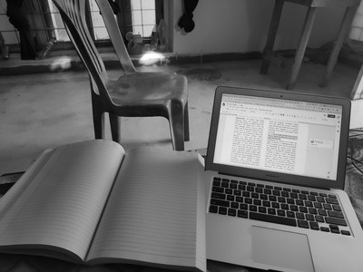

# Image-Thresholding
In this project, we will implement image thresholding using OpenCV in Python.

This is the input image:

This is the histogram of the image:

These are the output images using simple thresholding:

